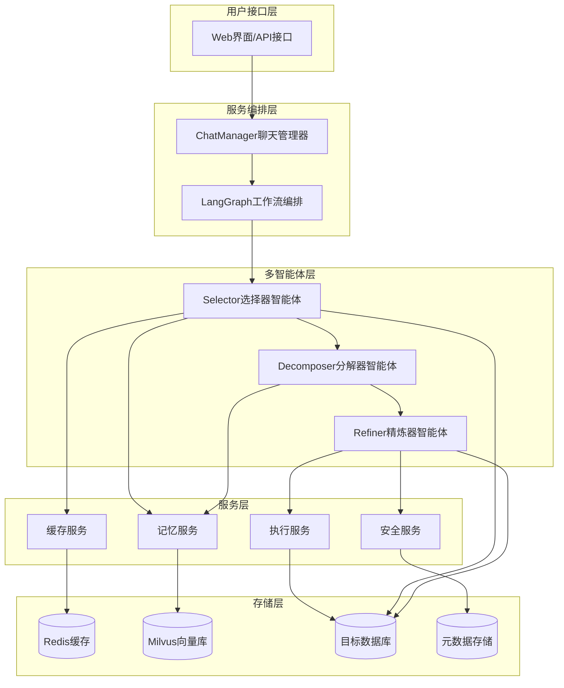

# 设计文档

## 概述

本文档描述了一个企业级Text2SQL多智能体服务系统的详细设计。该系统融合了Vanna.ai的RAG训练机制、MAC-SQL的三智能体协作架构，基于LangGraph工作流编排框架，集成Milvus向量数据库、Redis缓存和智能记忆学习功能，为企业用户提供高可用、高准确率的自然语言到SQL转换服务。

系统采用**增强型RAG（检索增强生成）架构**，结合**Vanna.ai的训练-提问两阶段模式**和**MAC-SQL的三智能体协作**，通过Selector（选择器）、Decomposer（分解器）、Refiner（精炼器）三个专业化智能体协作完成复杂的Text2SQL任务，并具备从历史查询中持续学习和改进的能力。

### 核心创新点

1. **Vanna.ai式RAG训练机制**: 支持DDL语句、文档、SQL查询、问题-SQL对等多种训练数据类型
2. **MAC-SQL三智能体协作**: 保持模式裁剪、查询分解、执行验证的专业化分工
3. **企业级向量记忆系统**: 基于Milvus的语义相似性检索和持续学习
4. **LangGraph工作流编排**: 支持复杂的条件路由和智能重试机制

## 架构

### 整体架构



### 核心组件架构

系统采用分层架构设计，参考MAC-SQL的三智能体协作模式，主要包括：

1. **用户接口层**: 提供RESTful API和Web界面
2. **服务编排层**: 基于LangGraph的工作流编排和ChatManager消息管理
3. **多智能体层**: 三个专业化智能体协作处理Text2SQL任务
4. **服务层**: 核心业务服务支撑（记忆、缓存、安全、执行）
5. **存储层**: 多种存储系统支持不同数据需求

**三智能体协作流程**:
- **Selector**: 分析查询意图，动态裁剪数据库模式，选择相关表和列
- **Decomposer**: 将复杂查询分解为子问题，逐步生成SQL语句
- **Refiner**: 执行SQL验证，根据错误反馈进行修正和优化

## Vanna.ai式RAG训练系统设计

### 1. 训练数据类型和管理

参考Vanna.ai的训练机制，系统支持多种类型的训练数据：

```python
class TrainingDataType(Enum):
    """训练数据类型"""
    DDL_STATEMENT = "ddl"           # 数据定义语言语句
    DOCUMENTATION = "doc"           # 业务文档和说明
    SQL_QUERY = "sql"              # SQL查询示例
    QUESTION_SQL_PAIR = "qa_pair"   # 问题-SQL对
    DOMAIN_KNOWLEDGE = "domain"     # 领域知识

@dataclass
class TrainingData:
    """训练数据记录"""
    id: str
    data_type: TrainingDataType
    content: str
    metadata: Dict[str, Any]
    db_id: str
    embedding: Optional[List[float]] = None
    created_at: datetime = field(default_factory=datetime.now)
    
    # 特定类型的字段
    question: Optional[str] = None      # 用于QA对
    sql: Optional[str] = None          # 用于QA对和SQL示例
    table_names: List[str] = field(default_factory=list)  # 相关表名
    tags: List[str] = field(default_factory=list)         # 标签
```

### 2. 训练服务架构

```python
class VannaTrainingService:
    """Vanna.ai式训练服务"""
    
    def __init__(self, vector_store: VectorStore, embedding_model: str = "text-embedding-ada-002"):
        self.vector_store = vector_store
        self.embedding_model = embedding_model
        self.training_data_store = {}
    
    def train_ddl(self, ddl_statements: List[str], db_id: str) -> bool:
        """训练DDL语句，让系统理解数据库结构"""
        for ddl in ddl_statements:
            training_data = TrainingData(
                id=self._generate_id(),
                data_type=TrainingDataType.DDL_STATEMENT,
                content=ddl,
                db_id=db_id,
                metadata={"source": "schema_discovery"}
            )
            self._store_training_data(training_data)
        return True
    
    def train_documentation(self, docs: List[Dict[str, str]], db_id: str) -> bool:
        """训练业务文档，提供业务上下文"""
        for doc in docs:
            training_data = TrainingData(
                id=self._generate_id(),
                data_type=TrainingDataType.DOCUMENTATION,
                content=doc["content"],
                db_id=db_id,
                metadata={
                    "title": doc.get("title", ""),
                    "category": doc.get("category", "general"),
                    "source": "documentation"
                }
            )
            self._store_training_data(training_data)
        return True
    
    def train_sql(self, sql_queries: List[str], db_id: str) -> bool:
        """训练SQL查询示例"""
        for sql in sql_queries:
            training_data = TrainingData(
                id=self._generate_id(),
                data_type=TrainingDataType.SQL_QUERY,
                content=sql,
                sql=sql,
                db_id=db_id,
                metadata={"source": "sql_examples"}
            )
            self._store_training_data(training_data)
        return True
    
    def train_qa_pairs(self, qa_pairs: List[Dict[str, str]], db_id: str) -> bool:
        """训练问题-SQL对，这是最直接的训练方式"""
        for pair in qa_pairs:
            training_data = TrainingData(
                id=self._generate_id(),
                data_type=TrainingDataType.QUESTION_SQL_PAIR,
                content=f"Q: {pair['question']}\nA: {pair['sql']}",
                question=pair["question"],
                sql=pair["sql"],
                db_id=db_id,
                metadata={"source": "qa_training"}
            )
            self._store_training_data(training_data)
        return True
    
    def _store_training_data(self, training_data: TrainingData):
        """存储训练数据到向量数据库"""
        # 生成向量嵌入
        embedding = self._generate_embedding(training_data.content)
        training_data.embedding = embedding
        
        # 存储到向量数据库
        self.vector_store.insert(
            id=training_data.id,
            vector=embedding,
            metadata={
                "data_type": training_data.data_type.value,
                "db_id": training_data.db_id,
                "content": training_data.content,
                "question": training_data.question,
                "sql": training_data.sql,
                **training_data.metadata
            }
        )
```

### 3. 增强型检索系统

```python
class EnhancedRAGRetriever:
    """增强型RAG检索器，结合Vanna.ai的检索策略"""
    
    def __init__(self, vector_store: VectorStore, training_service: VannaTrainingService):
        self.vector_store = vector_store
        self.training_service = training_service
    
    def retrieve_context(self, query: str, db_id: str, top_k: int = 5) -> Dict[str, List]:
        """检索与查询相关的上下文信息"""
        query_embedding = self._generate_embedding(query)
        
        # 多类型检索策略
        context = {
            "ddl_statements": [],
            "documentation": [],
            "sql_examples": [],
            "qa_pairs": [],
            "domain_knowledge": []
        }
        
        # 1. 检索相关的DDL语句
        ddl_results = self.vector_store.search(
            vector=query_embedding,
            filter={"data_type": "ddl", "db_id": db_id},
            limit=top_k
        )
        context["ddl_statements"] = [r.metadata["content"] for r in ddl_results]
        
        # 2. 检索相关的文档
        doc_results = self.vector_store.search(
            vector=query_embedding,
            filter={"data_type": "doc", "db_id": db_id},
            limit=top_k
        )
        context["documentation"] = [r.metadata["content"] for r in doc_results]
        
        # 3. 检索相似的SQL示例
        sql_results = self.vector_store.search(
            vector=query_embedding,
            filter={"data_type": "sql", "db_id": db_id},
            limit=top_k
        )
        context["sql_examples"] = [r.metadata["sql"] for r in sql_results]
        
        # 4. 检索相似的问题-SQL对
        qa_results = self.vector_store.search(
            vector=query_embedding,
            filter={"data_type": "qa_pair", "db_id": db_id},
            limit=top_k
        )
        context["qa_pairs"] = [
            {"question": r.metadata["question"], "sql": r.metadata["sql"]}
            for r in qa_results
        ]
        
        return context
    
    def build_enhanced_prompt(self, query: str, context: Dict[str, List], schema_info: str) -> str:
        """构建增强的提示词，结合检索到的上下文"""
        prompt_parts = [
            "# Text2SQL Task",
            f"Convert the following natural language question to SQL:",
            f"Question: {query}",
            "",
            "# Database Schema",
            schema_info,
            ""
        ]
        
        # 添加相关的DDL语句
        if context["ddl_statements"]:
            prompt_parts.extend([
                "# Relevant Database Definitions",
                *context["ddl_statements"],
                ""
            ])
        
        # 添加业务文档上下文
        if context["documentation"]:
            prompt_parts.extend([
                "# Business Context",
                *context["documentation"][:2],  # 限制数量
                ""
            ])
        
        # 添加相似的SQL示例
        if context["sql_examples"]:
            prompt_parts.extend([
                "# Similar SQL Examples",
                *context["sql_examples"][:3],  # 限制数量
                ""
            ])
        
        # 添加相似的问题-SQL对
        if context["qa_pairs"]:
            prompt_parts.append("# Similar Question-SQL Pairs")
            for pair in context["qa_pairs"][:2]:  # 限制数量
                prompt_parts.extend([
                    f"Q: {pair['question']}",
                    f"A: {pair['sql']}",
                    ""
                ])
        
        prompt_parts.extend([
            "# Instructions",
            "Based on the above context, generate a SQL query that answers the question.",
            "Ensure the SQL is syntactically correct and follows best practices.",
            "",
            "SQL:"
        ])
        
        return "\n".join(prompt_parts)
```

## 组件和接口

### 1. ChatManager 聊天管理器

**职责**: 协调多智能体协作，管理消息传递和错误处理

**核心接口**:
```python
class ChatManager:
    def __init__(self, data_path: str, tables_json_path: str, 
                 log_path: str, model_name: str, dataset_name: str):
        self.chat_group = [Selector(), Decomposer(), Refiner()]
    
    def start(self, user_message: dict) -> dict
    def _chat_single_round(self, message: dict) -> None
    def ping_network(self) -> bool
```

**状态管理**:
- 查询上下文状态
- 智能体执行状态  
- 错误和重试状态
- 学习反馈状态

### 2. Selector 选择器智能体

**职责**: 数据库模式理解和动态裁剪，选择查询相关的表和列

**核心功能**:
- 数据库模式自动扫描和理解
- 基于查询相关性的表和列选择
- 数据库统计信息收集（表数量、列数量等）
- 动态模式裁剪以减少token消耗

**接口定义**:
```python
class Selector(BaseAgent):
    def __init__(self, data_path: str, tables_json_path: str, 
                 model_name: str, dataset_name: str):
        self.db2infos = {}  # 数据库信息缓存
        self.db2dbjsons = {}  # 数据库元数据
    
    def talk(self, message: dict) -> dict
    def _get_db_desc_str(self, db_id: str, extracted_schema: dict) -> tuple
    def _is_need_prune(self, db_id: str, db_schema: str) -> bool
    def _prune(self, db_id: str, query: str, db_schema: str) -> dict
```

### 3. Decomposer 分解器智能体

**职责**: 查询分解和SQL生成，将复杂查询分解为子问题

**核心功能**:
- 自然语言查询分解为子问题
- 基于CoT（Chain of Thought）的SQL生成
- 支持多数据集的模板适配（BIRD、Spider等）
- 渐进式SQL构建

**接口定义**:
```python
class Decomposer(BaseAgent):
    def __init__(self, dataset_name: str):
        self.dataset_name = dataset_name
    
    def talk(self, message: dict) -> dict
    def _decompose_query(self, query: str, schema: str) -> List[str]
    def _generate_sql_steps(self, sub_questions: List[str]) -> str
```

### 4. Refiner 精炼器智能体

**职责**: SQL执行验证和错误修正，确保生成的SQL正确可执行

**核心功能**:
- SQL语法和语义验证
- 数据库执行和结果验证
- 基于错误反馈的SQL修正
- 安全性检查（SQL注入防护）
- 执行超时控制

**接口定义**:
```python
class Refiner(BaseAgent):
    def __init__(self, data_path: str, dataset_name: str):
        self.data_path = data_path
        self.dataset_name = dataset_name
    
    def talk(self, message: dict) -> dict
    def _execute_sql(self, sql: str, db_id: str) -> dict
    def _is_need_refine(self, exec_result: dict) -> bool
    def _refine_sql(self, sql: str, error_info: dict) -> str
```

**职责**: SQL执行验证和错误修正

**核心功能**:
- 实际SQL执行和结果验证
- 基于执行错误的SQL修正
- 安全性检查和SQL注入防护
- 执行超时控制

**接口定义**:
```python
class Refiner(BaseAgent):
    def __init__(self, data_path: str, dataset_name: str):
        self.data_path = data_path
    
    def talk(self, message: dict) -> dict
    def _execute_sql(self, sql: str, db_id: str) -> dict
    def _is_need_refine(self, exec_result: dict) -> bool
    def _refine_sql(self, sql: str, error: str, context: dict) -> str
```

## 数据模型

### 1. 消息传递模型

```python
@dataclass
class ChatMessage:
    """智能体间消息传递的标准格式"""
    db_id: str
    query: str
    evidence: str = ""
    extracted_schema: dict = None
    desc_str: str = ""
    fk_str: str = ""
    final_sql: str = ""
    qa_pairs: str = ""
    send_to: str = "System"
    pruned: bool = False
    fixed: bool = False
    execution_result: dict = None
    chosen_db_schema_dict: dict = None
```

### 2. 数据库信息模型

```python
@dataclass
class DatabaseInfo:
    """数据库元数据信息"""
    desc_dict: Dict[str, List[Tuple[str, str, str]]]  # 表->列描述
    value_dict: Dict[str, List[Tuple[str, str]]]      # 表->列值示例
    pk_dict: Dict[str, List[str]]                     # 表->主键列
    fk_dict: Dict[str, List[Tuple[str, str, str]]]    # 表->外键关系

@dataclass
class DatabaseStats:
    """数据库统计信息"""
    table_count: int
    max_column_count: int
    total_column_count: int
    avg_column_count: int
```

### 3. SQL执行结果模型

```python
@dataclass
class SQLExecutionResult:
    """SQL执行结果"""
    sql: str
    data: List[Tuple] = None
    sqlite_error: str = ""
    exception_class: str = ""
    execution_time: float = 0.0
    is_successful: bool = False
```

### 4. 训练数据模型

```python
class TrainingDataType(Enum):
    """训练数据类型"""
    DDL_STATEMENT = "ddl"           # 数据定义语言语句
    DOCUMENTATION = "doc"           # 业务文档和说明
    SQL_QUERY = "sql"              # SQL查询示例
    QUESTION_SQL_PAIR = "qa_pair"   # 问题-SQL对
    DOMAIN_KNOWLEDGE = "domain"     # 领域知识

@dataclass
class TrainingData:
    """训练数据记录"""
    id: str
    data_type: TrainingDataType
    content: str
    metadata: Dict[str, Any]
    db_id: str
    embedding: Optional[List[float]] = None
    created_at: datetime = field(default_factory=datetime.now)
    
    # 特定类型的字段
    question: Optional[str] = None      # 用于QA对
    sql: Optional[str] = None          # 用于QA对和SQL示例
    table_names: List[str] = field(default_factory=list)  # 相关表名
    tags: List[str] = field(default_factory=list)         # 标签
```

### 5. 记忆学习模型

```python
@dataclass
class MemoryRecord:
    """记忆存储记录"""
    id: str
    natural_query: str
    sql_query: str
    db_id: str
    is_correct: bool
    user_feedback: str
    execution_result: SQLExecutionResult
    embedding: List[float]
    similarity_score: float = 0.0
    usage_count: int = 0
    created_at: datetime = field(default_factory=datetime.now)
    updated_at: datetime = field(default_factory=datetime.now)

@dataclass
class LearningMetrics:
    """学习效果评估指标"""
    accuracy_trend: List[float]
    pattern_coverage: Dict[str, int]
    error_reduction_rate: float
    improvement_rate: float
```

## MAC-SQL优化集成

### 1. 动态模式裁剪优化

**基于查询相关性的智能裁剪**:
```python
class SchemaSelector:
    def __init__(self):
        self.token_threshold = 25000  # 基于tiktoken的token限制
    
    def is_need_prune(self, db_id: str, db_schema: str) -> bool:
        """判断是否需要进行模式裁剪"""
        db_stats = self.get_db_stats(db_id)
        return (db_stats.avg_column_count > 6 or 
                db_stats.total_column_count > 30)
    
    def prune_schema(self, query: str, db_schema: str) -> dict:
        """基于查询相关性裁剪数据库模式"""
        # 使用LLM分析查询与表/列的相关性
        # 返回 {"table_name": ["col1", "col2"] 或 "keep_all" 或 "drop_all"}
```

### 2. 分步骤SQL生成优化

**基于子问题分解的CoT方法**:
```python
class QueryDecomposer:
    def decompose_and_generate(self, query: str, schema: str, evidence: str) -> str:
        """
        分解查询为子问题并逐步生成SQL
        
        示例流程:
        Sub question 1: 获取平均SAT优秀率
        SQL: SELECT AVG(CAST(NumGE1500 AS REAL) / NumTstTakr) FROM ...
        
        Sub question 2: 列出超过平均值的学校
        SQL: SELECT sname FROM ... WHERE excellence_rate > (subquery)
        """
        prompt = self._build_decompose_prompt(query, schema, evidence)
        response = self.llm_call(prompt)
        return self._extract_final_sql(response)
```

### 3. 实际执行验证优化

**SQL执行和错误修正机制**:
```python
class SQLRefiner:
    @func_set_timeout(120)  # 120秒超时保护
    def execute_and_refine(self, sql: str, db_id: str, context: dict) -> dict:
        """执行SQL并根据错误进行修正"""
        exec_result = self._execute_sql(sql, db_id)
        
        if self._is_need_refine(exec_result):
            # 基于错误信息生成修正提示
            refined_sql = self._refine_with_error_feedback(
                sql, exec_result, context
            )
            return self.execute_and_refine(refined_sql, db_id, context)
        
        return exec_result
    
    def _refine_with_error_feedback(self, sql: str, error: dict, context: dict) -> str:
        """基于执行错误生成修正的SQL"""
        refine_prompt = self._build_refine_prompt(sql, error, context)
        return self.llm_call(refine_prompt)
```

### 4. 智能体协作流程优化

**基于消息传递的协作模式**:
```python
class OptimizedChatManager:
    def __init__(self):
        self.max_rounds = 3  # 最大协作轮次
        self.agents = {
            "Selector": SelectorAgent(),
            "Decomposer": DecomposerAgent(), 
            "Refiner": RefinerAgent()
        }
    
    def process_query(self, message: dict) -> dict:
        """优化的查询处理流程"""
        message['send_to'] = 'Selector'
        
        for round_num in range(self.max_rounds):
            current_agent = self.agents[message['send_to']]
            current_agent.talk(message)
            
            if message['send_to'] == 'System':  # 处理完成
                break
                
        return message
```

## LangGraph工作流设计

### 1. 状态图定义

```python
from typing import TypedDict, List
from langgraph import StateGraph

class Text2SQLState(TypedDict):
    """LangGraph状态定义"""
    # 输入信息
    db_id: str
    query: str
    evidence: str
    user_id: str
    
    # 处理状态
    current_agent: str
    retry_count: int
    max_retries: int
    
    # Selector输出
    extracted_schema: dict
    desc_str: str
    fk_str: str
    pruned: bool
    
    # Decomposer输出
    final_sql: str
    qa_pairs: str
    sub_questions: List[str]
    
    # Refiner输出
    execution_result: dict
    is_correct: bool
    error_message: str
    
    # 最终结果
    result: dict
    finished: bool
```

### 2. 工作流节点定义

```python
def selector_node(state: Text2SQLState) -> Text2SQLState:
    """Selector智能体节点"""
    selector = SelectorAgent()
    message = {
        'db_id': state['db_id'],
        'query': state['query'],
        'evidence': state['evidence'],
        'send_to': 'Selector'
    }
    result = selector.talk(message)
    
    state.update({
        'extracted_schema': result.get('extracted_schema', {}),
        'desc_str': result.get('desc_str', ''),
        'fk_str': result.get('fk_str', ''),
        'pruned': result.get('pruned', False),
        'current_agent': 'Decomposer'
    })
    return state

def decomposer_node(state: Text2SQLState) -> Text2SQLState:
    """Decomposer智能体节点"""
    decomposer = DecomposerAgent()
    message = {
        'query': state['query'],
        'evidence': state['evidence'],
        'desc_str': state['desc_str'],
        'fk_str': state['fk_str'],
        'send_to': 'Decomposer'
    }
    result = decomposer.talk(message)
    
    state.update({
        'final_sql': result.get('final_sql', ''),
        'qa_pairs': result.get('qa_pairs', ''),
        'current_agent': 'Refiner'
    })
    return state

def refiner_node(state: Text2SQLState) -> Text2SQLState:
    """Refiner智能体节点"""
    refiner = RefinerAgent()
    message = {
        'db_id': state['db_id'],
        'final_sql': state['final_sql'],
        'desc_str': state['desc_str'],
        'fk_str': state['fk_str'],
        'send_to': 'Refiner'
    }
    result = refiner.talk(message)
    
    state.update({
        'execution_result': result.get('execution_result', {}),
        'is_correct': result.get('is_correct', False),
        'error_message': result.get('error_message', ''),
        'finished': True
    })
    return state
```

### 3. 条件路由逻辑

```python
def should_continue(state: Text2SQLState) -> str:
    """决定工作流下一步"""
    if state['finished']:
        return "end"
    
    if state['current_agent'] == 'Selector':
        return "decomposer"
    elif state['current_agent'] == 'Decomposer':
        return "refiner"
    elif state['current_agent'] == 'Refiner':
        if not state['is_correct'] and state['retry_count'] < state['max_retries']:
            state['retry_count'] += 1
            state['current_agent'] = 'Decomposer'
            return "decomposer"
        else:
            return "end"
    
    return "end"
```

### 4. 工作流构建

```python
def create_text2sql_workflow() -> StateGraph:
    """创建Text2SQL工作流"""
    workflow = StateGraph(Text2SQLState)
    
    # 添加节点
    workflow.add_node("selector", selector_node)
    workflow.add_node("decomposer", decomposer_node)
    workflow.add_node("refiner", refiner_node)
    
    # 设置入口点
    workflow.set_entry_point("selector")
    
    # 添加边
    workflow.add_edge("selector", "decomposer")
    workflow.add_conditional_edges(
        "decomposer",
        should_continue,
        {
            "refiner": "refiner",
            "end": END
        }
    )
    workflow.add_conditional_edges(
        "refiner",
        should_continue,
        {
            "decomposer": "decomposer",
            "end": END
        }
    )
    
    return workflow.compile()
```

## 错误处理

### 1. 分层错误处理策略

**智能体级别错误处理**:
- 单个智能体执行失败时的本地重试（最多3次）
- LLM调用超时处理（120秒超时限制）
- 降级策略（如Selector跳过裁剪，直接使用完整模式）
- 错误上下文保存和传递

**工作流级别错误处理**:
- 智能体间协作失败处理
- LangGraph状态回滚和恢复机制
- 基于错误类型的智能重试（SQL语法错误vs执行错误）
- 替代执行路径选择

**系统级别错误处理**:
- 外部依赖失败的处理（数据库连接、向量数据库、缓存）
- 资源不足时的限流和降级
- 网络异常的自动重连机制
- 灾难恢复和故障转移

### 2. 重试机制设计

thon
class Retrycy:

    base_del0
    ma0
    expone0
    jitter: bool = True
    
    def calculate_delay(self, a> float:
        delay = min(self.base_
        if self.jitter:
            delay *= (0.5)
        return delay
```

### 3. 熔断模式

```python
class CircuitBreaker:
    def __init__(self, failure_threshold: int = 5, timeou = 60):
        self.failure_threshold =shold
        self.timeout = eout
        self.failure_coun= 0
        self.last_faNone
        self.state = CiD
    
  ny:

         
                self.state = 
            else:
                raise CircuitBreakerOpenError()
        
        try:
            result
            self.on_sucess()
            return result
  s e:
   )
e
```

## 智能模式裁剪策略

### 1. 模式复杂度评估

参考MAC-SQL的动态裁剪机制，系统会根据数据库复杂度自动决定是否需要模式裁剪：

```python
class SchemaPruningStrategy:
    def __init__(self):
        self.complexity_thresholds = {
            'avg_column_count': 6,
            'total_column_count': 30,
            'token_limit': 25000
        }
    
    def is_need_prune(self, db_stats: DatabaseStats, schema_text: str) -> bool:
        """判断是否需要进行模式裁剪"""
        # 基于列数量的判断
        if (db_stats.avg_column_count <= self.complexity_thresholds['avg_column_count'] 
            and db_stats.total_column_count <= self.complexity_thresholds['total_column_count']):
            return False
        
        # 基于token数量的判断
        token_count = self._count_tokens(schema_text)
        return token_count >= self.complexity_thresholds['token_limit']
```

### 2. 智能表和列选择

```python
class TableColumnSelector:
    def select_relevant_schema(self, query: str, db_schema: dict) -> dict:
        """基于查询相关性选择表和列"""
        selection_result = {}
        
        for table_name, columns in db_schema.items():
            if len(columns) <= 10:
                # 小表保持完整
                selection_result[table_name] = "keep_all"
            elif self._is_table_irrelevant(query, table_name, columns):
                # 完全无关的表丢弃
                selection_result[table_name] = "drop_all"
            else:
                # 选择最相关的6列
                relevant_columns = self._select_top_columns(query, columns, top_k=6)
                selection_result[table_name] = relevant_columns
        
        return selection_result
```

### 3. 渐进式模式构建

```python
class ProgressiveSchemaBuilder:
    def build_schema_description(self, table_name: str, columns: List, 
                               column_values: List) -> str:
        """构建表模式描述"""
        schema_desc = f"# Table: {table_name}\n[\n"
        
        column_descriptions = []
        for (col_name, full_name, extra_desc), (_, value_examples) in zip(columns, column_values):
            col_desc = f"  ({col_name}"
            
            if full_name:
                col_desc += f", {full_name}"
            
            if value_examples:
                col_desc += f". Value examples: {value_examples}"
            
            if extra_desc:
                col_desc += f". {extra_desc}"
            
            col_desc += "),"
            column_descriptions.append(col_desc)
        
        schema_desc += "\n".join(column_descriptions).rstrip(',')
        schema_desc += "\n]\n"
        
        return schema_desc
```

## 测试策略

### 1. 单元测试

**智能体测试**:
- 每个智能体的核心功能测试
的测试
- 边界条件和异常情况测

**服务层测试**:
- 记忆服务的存储和检索测试
 缓存服务的性能测试
- 安全服务的防护能力测试

### 2. 集成测试

**工作流测试**:

- 智能体协作场景
- 错误处理和恢复测试

**存储集成测试**:
- Milvus向量检索准确性测试
- Redis缓存一致性测试
- 数据库连接和查询测试

### 3. 性能测试

**负载测试**:
- 并发查询处理能力测试
- 系统资源使用率测试
- 响应时间分布测试

**压力测试**:
- 极限负载下的系统稳定性
- 内存和CPU使用峰值测试
- 存储系统性能瓶颈测试

### 4. 准确性测试

**SQL正确性测试**:
- 基于BIRD和Spider数据集的标准测试
- 复杂查询场景测试（多表JOIN、聚合函数、子查询）
- 执行准确性测试（EX: Execution Accuracy）
- 有效效率评分测试（VES: Valid Efficiency Score）

**智能体协作测试**:
- Selector模式裁剪准确性测试
- Decomposer子问题分解质量测试  
- Refiner错误修正能力测试
- 端到端协作流程测试

**学习能力测试**:
- 记忆系统学习能力验证
- 准确率提升趋势分析
- 错误模式识别和避免测试
- 相似查询检索准确性测试

**数据集兼容性测试**:
```python
class DatasetCompatibilityTest:
    def test_bird_dataset(self):
        """测试BIRD数据集兼容性"""
        # 测试复杂的业务场景查询
        # 测试Evidence知识的使用
        
    def test_spider_dataset(self):
        """测试Spider数据集兼容性"""  
        # 测试标准的学术查询场景
        # 测试多种数据库类型
```
## 
智能记忆和学习系统

### 1. 记忆存储架构

**向量化存储策略**:
- 使用Milvus存储查询对的向量表示
- 支持多种嵌入模型（OpenAI、Sentence-BERT等）
- 实现语义相似性快速检索

**记忆分类体系**:
```python
class MemoryType(Enum):
    POSITIVE_EXAMPLE = "positive"  # 正确的查询示例
    NEGATIVE_EXAMPLE = "negative"  # 错误的查询示例
    PATTERN_TEMPLATE = "template"  # 查询模式模板
    DOMAIN_KNOWLEDGE = "domain"    # 领域知识
```

### 2. 学习机制设计

**增量学习流程**:
1. 用户反馈收集和验证
2. 查询对向量化和存储
3. 相似性索引更新
4. 模式识别和模板提取

**学习效果评估**:
```python
class LearningMetrics:
    def __init__(self):
        self.accuracy_trend = []
        self.pattern_coverage = {}
        self.error_reduction_rate = 0.0
    
    def update_accuracy(self, correct_count: int, total_count: int):
        accuracy = correct_count / total_count
        self.accuracy_trend.append(accuracy)
    
    def calculate_improvement(self) -> float:
        if len(self.accuracy_trend) < 2:
            return 0.0
        return self.accuracy_trend[-1] - self.accuracy_trend[0]
```

## 缓存策略设计

### 1. 多层缓存架构

**L1缓存 - 内存缓存**:
- 最近查询结果的内存缓存
- LRU淘汰策略
- 容量限制：1000个查询结果

**L2缓存 - Redis分布式缓存**:
- 跨实例共享的查询结果缓存
- 支持集群模式和高可用
- TTL设置：24小时

**L3缓存 - 向量相似性缓存**:
- 相似查询的预计算结果
- 基于Milvus的向量检索缓存
- 动态更新和失效机制

### 2. 缓存键设计

```python
class CacheKeyGenerator:
    @staticmethod
    def generate_query_key(query: str, db_schema_hash: str) -> str:
        query_hash = hashlib.md5(query.lower().encode()).hexdigest()
        return f"query:{query_hash}:{db_schema_hash}"
    
    @staticmethod
    def generate_similarity_key(embedding: List[float]) -> str:
        embedding_hash = hashlib.md5(str(embedding).encode()).hexdigest()
        return f"similarity:{embedding_hash}"
```

## 安全性设计

### 1. SQL注入防护

**多层防护策略**:
```python
class SQLSecurityValidator:
    def __init__(self):
        self.dangerous_patterns = [
            r";\s*(drop|delete|update|insert|create|alter)",
            r"union\s+select",
            r"exec\s*\(",
            r"xp_cmdshell",
        ]
    
    def validate_sql(self, sql: str) -> SecurityValidationResult:
        # 1. 模式匹配检查
        for pattern in self.dangerous_patterns:
            if re.search(pattern, sql, re.IGNORECASE):
                return SecurityValidationResult(
                    is_safe=False,
                    risk_level=RiskLevel.HIGH,
                    detected_pattern=pattern
                )
        
        # 2. AST语法树分析
        try:
            parsed = sqlparse.parse(sql)[0]
            return self._analyze_ast(parsed)
        except Exception as e:
            return SecurityValidationResult(
                is_safe=False,
                risk_level=RiskLevel.MEDIUM,
                error=str(e)
            )
```

### 2. 权限控制系统

**基于角色的访问控制**:
```python
class PermissionManager:
    def __init__(self):
        self.role_permissions = {
            "viewer": ["SELECT"],
            "analyst": ["SELECT", "WITH"],
            "admin": ["SELECT", "INSERT", "UPDATE", "DELETE"]
        }
    
    def check_permission(self, user_role: str, sql: str) -> bool:
        allowed_operations = self.role_permissions.get(user_role, [])
        sql_operations = self._extract_operations(sql)
        return all(op in allowed_operations for op in sql_operations)
```

## 监控和可观测性

### 1. 指标收集系统

**核心指标定义**:
```python
class SystemMetrics:
    def __init__(self):
        self.query_count = Counter()
        self.response_time = Histogram()
        self.accuracy_rate = Gauge()
        self.error_rate = Gauge()
        self.cache_hit_rate = Gauge()
        self.agent_performance = {}
    
    def record_query(self, query_type: str, response_time: float, is_successful: bool):
        self.query_count.inc(labels={"type": query_type})
        self.response_time.observe(response_time)
        if is_successful:
            self.accuracy_rate.inc()
        else:
            self.error_rate.inc()
```

### 2. 分布式追踪

**请求链路追踪**:
```python
class QueryTracer:
    def __init__(self):
        self.tracer = opentelemetry.trace.get_tracer(__name__)
    
    def trace_query_execution(self, query_id: str):
        with self.tracer.start_as_current_span("text2sql_query") as span:
            span.set_attribute("query.id", query_id)
            span.set_attribute("service.name", "text2sql-service")
            
            # 智能体执行追踪
            with self.tracer.start_as_current_span("intent_understanding"):
                # 意图理解执行
                pass
            
            with self.tracer.start_as_current_span("sql_generation"):
                # SQL生成执行
                pass
```

## 部署架构

### 1. 容器化部署

**Docker Compose配置**:
```yaml
version: '3.8'
services:
  text2sql-service:
    build: .
    ports:
      - "8000:8000"
    environment:
      - REDIS_URL=redis://redis:6379
      - MILVUS_HOST=milvus
      - DATABASE_URL=postgresql://user:pass@db:5432/text2sql
    depends_on:
      - redis
      - milvus
      - postgres
  
  redis:
    image: redis:7-alpine
    ports:
      - "6379:6379"
  
  milvus:
    image: milvusdb/milvus:latest
    ports:
      - "19530:19530"
    volumes:
      - milvus_data:/var/lib/milvus
  
  postgres:
    image: postgres:15
    environment:
      POSTGRES_DB: text2sql
      POSTGRES_USER: user
      POSTGRES_PASSWORD: pass
    volumes:
      - postgres_data:/var/lib/postgresql/data
```

### 2. 微服务架构

**服务拆分策略**:
- **核心服务**: Text2SQL主服务
- **记忆服务**: 独立的学习和记忆管理服务
- **缓存服务**: Redis缓存管理服务
- **监控服务**: 指标收集和告警服务

### 3. 扩展性设计

**水平扩展支持**:
- 无状态服务设计
- 负载均衡器配置
- 数据库连接池管理
- 分布式缓存同步

**垂直扩展优化**:
- GPU加速的向量计算
- 内存优化的模型加载
- 异步处理和队列机制

## 性能优化策略

### 1. 查询优化

**预处理优化**:
- 查询模板预编译
- 常用模式缓存
- 批量向量计算

**执行优化**:
- 并行智能体执行
- 异步数据库查询
- 连接池复用

### 2. 内存管理

**模型加载优化**:
```python
class ModelManager:
    def __init__(self):
        self.model_cache = {}
        self.max_cache_size = 3
    
    def get_model(self, model_name: str):
        if model_name not in self.model_cache:
            if len(self.model_cache) >= self.max_cache_size:
                # LRU淘汰最少使用的模型
                oldest_model = min(self.model_cache.items(), 
                                 key=lambda x: x[1].last_used)
                del self.model_cache[oldest_model[0]]
            
            self.model_cache[model_name] = self._load_model(model_name)
        
        self.model_cache[model_name].last_used = time.time()
        return self.model_cache[model_name]
```

## 配置管理

### 1. 环境配置

**配置文件结构**:
```python
class SystemConfig:
    def __init__(self):
        self.llm_config = LLMConfig()
        self.database_config = DatabaseConfig()
        self.cache_config = CacheConfig()
        self.vector_store_config = VectorStoreConfig()
        self.training_config = TrainingConfig()
        self.security_config = SecurityConfig()
        self.monitoring_config = MonitoringConfig()

class LLMConfig:
    model_name: str = "gpt-4"
    api_key: str = os.getenv("OPENAI_API_KEY")
    max_tokens: int = 2000
    temperature: float = 0.1
    timeout: int = 30

class TrainingConfig:
    """Vanna.ai式训练配置"""
    embedding_model: str = "text-embedding-ada-002"
    auto_train_ddl: bool = True
    auto_train_successful_queries: bool = True
    training_batch_size: int = 100
    similarity_threshold: float = 0.8
    max_training_examples: int = 10000

class DatabaseConfig:
    host: str = os.getenv("DB_HOST", "localhost")
    port: int = int(os.getenv("DB_PORT", "5432"))
    username: str = os.getenv("DB_USER")
    password: str = os.getenv("DB_PASSWORD")
    database: str = os.getenv("DB_NAME")
```

### 2. 动态配置更新

**配置热更新机制**:
- 配置文件监控
- 配置变更通知
- 无缝配置切换
- 配置回滚支持

## MAC-SQL架构优化总结

### 1. 核心架构借鉴

本设计参考MAC-SQL的三智能体协作架构，并结合LangGraph进行了以下优化：

**原MAC-SQL架构**:
- Selector: 数据库模式选择和裁剪
- Decomposer: 查询分解和SQL生成  
- Refiner: SQL执行验证和修正

**优化后的架构**:
- 保持三智能体核心职责不变
- 使用LangGraph替代简单的消息传递机制
- 增加企业级的缓存、记忆学习和监控功能
- 添加向量相似性检索增强生成能力

### 2. 关键改进点

**工作流编排**:
- 从简单的轮询机制升级为LangGraph状态机
- 支持条件路由和智能重试
- 更好的错误处理和状态管理

**智能记忆系统**:
- 集成Milvus向量数据库进行语义相似性搜索
- 支持从历史成功案例中学习
- 持续改进查询准确率

**企业级特性**:
- Redis缓存提升响应速度
- 完善的监控和可观测性
- 安全性和权限控制
- 多数据库支持和高可用性

### 3. 技术栈对比

| 组件 | MAC-SQL | 优化后系统 |
|------|---------|------------|
| 工作流编排 | 简单消息传递 | LangGraph状态机 |
| 缓存机制 | 无 | Redis多层缓存 |
| 记忆学习 | 无 | Milvus向量检索 |
| 监控告警 | 基础日志 | 完整可观测性 |
| 安全防护 | 基础验证 | 企业级安全 |
| 扩展性 | 单机运行 | 分布式部署 |

这个设计文档提供了一个全面的企业级Text2SQL多智能体服务系统架构，在保持MAC-SQL核心优势的基础上，结合了现代AI技术栈和企业级可靠性要求，为后续的实现提供了详细的技术指导。