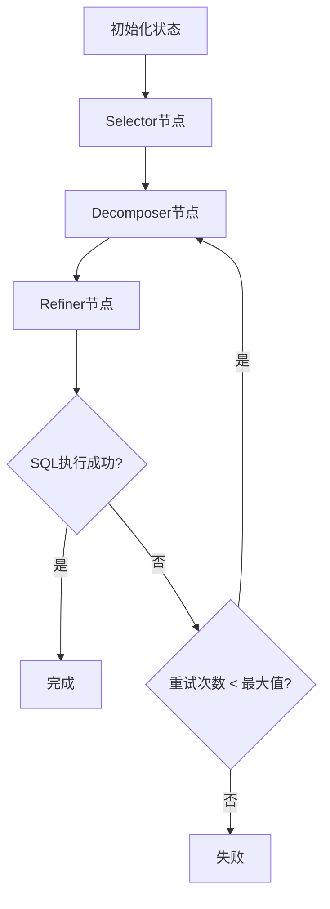

# LangGraph工作流编排系统

## 概述

本文档描述了Text2SQL多智能体系统的LangGraph工作流编排实现。该系统通过状态定义、节点函数和条件路由逻辑，实现了Selector、Decomposer、Refiner三个智能体的协作处理流程。

## 核心组件

### 1. 状态定义 (Text2SQLState)

`Text2SQLState` 是一个TypedDict，定义了工作流中所有必要的状态信息：

```python
class Text2SQLState(TypedDict):
    # 输入信息
    db_id: str                          # 数据库标识符
    query: str                          # 用户自然语言查询
    evidence: str                       # 查询证据和上下文信息
    user_id: Optional[str]              # 用户标识符
    
    # 处理状态
    current_agent: str                  # 当前处理的智能体
    retry_count: int                    # 重试计数
    max_retries: int                    # 最大重试次数
    processing_stage: str               # 处理阶段标识
    
    # 智能体输出
    extracted_schema: Optional[Dict[str, Any]]  # Selector输出
    final_sql: str                      # Decomposer输出
    execution_result: Optional[Dict[str, Any]]  # Refiner输出
    
    # 最终结果
    result: Optional[Dict[str, Any]]    # 最终处理结果
    finished: bool                      # 是否完成处理
    success: bool                       # 是否成功
```

### 2. 节点函数

#### Selector节点 (selector_node)

负责数据库模式理解和动态裁剪：

```python
def selector_node(state: Text2SQLState) -> Text2SQLState:
    """
    处理数据库模式理解和动态裁剪，选择查询相关的表和列
    """
    # 创建Selector智能体实例
    selector = Selector(
        data_path="data",  # 从配置中获取
        tables_json_path="data/tables.json",  # 从配置中获取
        model_name="gpt-4",  # 从配置中获取
        dataset_name="bird"  # 从配置中获取
    )
    
    # 构建消息
    message = {
        'db_id': state['db_id'],
        'query': state['query'],
        'evidence': state['evidence'],
        'send_to': 'Selector'
    }
    
    # 调用Selector智能体
    result = selector.talk(message)
    
    # 更新状态，包含执行时间监控
    execution_time = time.time() - start_time
    state.update({
        'extracted_schema': result.get('extracted_schema', {}),
        'desc_str': result.get('desc_str', ''),
        'fk_str': result.get('fk_str', ''),
        'pruned': result.get('pruned', False),
        'chosen_db_schema_dict': result.get('chosen_db_schema_dict', {}),
        'current_agent': 'Decomposer',
        'processing_stage': 'schema_selection_completed',
        'agent_execution_times': {
            **state.get('agent_execution_times', {}),
            'selector': execution_time
        }
    })
    
    return state
```

#### Decomposer节点 (decomposer_node)

负责查询分解和SQL生成：

```python
def decomposer_node(state: Text2SQLState) -> Text2SQLState:
    """
    处理查询分解和SQL生成，将复杂查询分解为子问题并生成SQL语句
    """
    # 创建Decomposer智能体实例
    decomposer = Decomposer(dataset_name="bird")  # 从配置中获取
    
    # 构建消息
    message = {
        'db_id': state['db_id'],
        'query': state['query'],
        'evidence': state['evidence'],
        'desc_str': state['desc_str'],
        'fk_str': state['fk_str'],
        'extracted_schema': state.get('extracted_schema', {}),
        'send_to': 'Decomposer'
    }
    
    # 调用Decomposer智能体
    result = decomposer.talk(message)
    
    # 更新状态，包含执行时间监控
    execution_time = time.time() - start_time
    state.update({
        'final_sql': result.get('final_sql', ''),
        'qa_pairs': result.get('qa_pairs', ''),
        'sub_questions': result.get('sub_questions', []),
        'decomposition_strategy': result.get('decomposition_strategy', 'simple'),
        'current_agent': 'Refiner',
        'processing_stage': 'sql_generation_completed',
        'agent_execution_times': {
            **state.get('agent_execution_times', {}),
            'decomposer': execution_time
        }
    })
    
    return state
```

#### Refiner节点 (refiner_node)

负责SQL执行验证和错误修正：

```python
def refiner_node(state: Text2SQLState) -> Text2SQLState:
    """
    处理SQL执行验证和错误修正，确保生成的SQL正确可执行
    """
    # 创建Refiner智能体实例
    refiner = Refiner(
        data_path="data",  # 从配置中获取
        dataset_name="bird"  # 从配置中获取
    )
    
    # 构建消息
    message = {
        'db_id': state['db_id'],
        'query': state['query'],
        'final_sql': state['final_sql'],
        'desc_str': state['desc_str'],
        'fk_str': state['fk_str'],
        'send_to': 'Refiner'
    }
    
    # 调用Refiner智能体
    result = refiner.talk(message)
    
    # 更新状态，包含执行时间监控和重试逻辑
    execution_time = time.time() - start_time
    execution_result = result.get('execution_result', {})
    is_successful = execution_result.get('is_successful', False)
    
    state.update({
        'execution_result': execution_result,
        'is_correct': is_successful,
        'error_message': execution_result.get('sqlite_error', ''),
        'fixed': result.get('fixed', False),
        'refinement_attempts': state.get('refinement_attempts', 0) + 1,
        'processing_stage': 'sql_validation_completed',
        'agent_execution_times': {
            **state.get('agent_execution_times', {}),
            'refiner': execution_time
        }
    })
    
    # 如果SQL执行成功，标记为完成
    if is_successful:
        state.update({
            'finished': True,
            'success': True,
            'current_agent': 'Completed',
            'result': {
                'sql': state['final_sql'],
                'execution_result': execution_result,
                'processing_time': sum(state['agent_execution_times'].values())
            }
        })
    else:
        # 如果需要重试且未超过最大重试次数
        if state['retry_count'] < state['max_retries']:
            state.update({
                'current_agent': 'Decomposer',
                'processing_stage': 'retry_sql_generation'
            })
        else:
            state.update({
                'finished': True,
                'success': False,
                'current_agent': 'Failed',
                'result': {
                    'error': state['error_message'],
                    'failed_sql': state['final_sql'],
                    'processing_time': sum(state['agent_execution_times'].values())
                }
            })
    
    return state
```

### 3. 条件路由逻辑 (should_continue)

根据当前状态决定工作流的下一步执行路径：

```python
def should_continue(state: Text2SQLState) -> str:
    """
    条件路由逻辑函数，支持智能重试和错误处理
    """
    # 如果已完成或出错，结束工作流
    if state['finished'] or state['current_agent'] in ['Completed', 'Failed', 'Error']:
        return "end"
    
    # 根据当前智能体决定下一步
    if state['current_agent'] == 'Selector':
        return "decomposer"
    elif state['current_agent'] == 'Decomposer':
        return "refiner"
    elif state['current_agent'] == 'Refiner':
        # 如果需要重试且未超过最大重试次数
        if not state['is_correct'] and state['retry_count'] < state['max_retries']:
            state['retry_count'] += 1
            return "decomposer"
        else:
            return "end"
    
    return "end"
```

## 工作流执行流程

### 1. 初始化阶段

```python
state = initialize_state(
    db_id="california_schools",
    query="List all schools in Los Angeles with SAT scores above 1400",
    evidence="The database contains school information",
    max_retries=3
)
```

### 2. 执行流程

1. **Selector阶段**: 分析查询意图，动态裁剪数据库模式
2. **Decomposer阶段**: 将查询分解为子问题，生成SQL语句
3. **Refiner阶段**: 执行SQL验证，根据错误反馈进行修正
4. **重试机制**: 如果SQL执行失败，返回Decomposer重新生成

### 3. 状态流转图



## 错误处理和重试机制

### 1. 智能体级别错误处理

- 单个智能体执行失败时的异常捕获
- 错误信息记录和状态更新
- 执行时间监控和超时处理

### 2. 工作流级别重试机制

- 基于SQL执行结果的智能重试
- 最大重试次数限制（默认3次）
- 重试计数和状态跟踪

### 3. 状态监控

- 各智能体执行时间记录
- 处理阶段标识和状态跟踪
- 总处理时间和性能监控

## 使用示例

### 基本使用

```python
from services.workflow import (
    initialize_state,
    selector_node,
    decomposer_node,
    refiner_node,
    should_continue,
    finalize_state
)

# 初始化状态
state = initialize_state(
    db_id="test_db",
    query="Show me all customers from New York",
    evidence="Customer table contains location information"
)

# 执行工作流
while not state['finished']:
    if state['current_agent'] == 'Selector':
        state = selector_node(state)
    elif state['current_agent'] == 'Decomposer':
        state = decomposer_node(state)
    elif state['current_agent'] == 'Refiner':
        state = refiner_node(state)
    
    # 检查是否继续
    next_step = should_continue(state)
    if next_step == "end":
        break

# 完成处理
final_state = finalize_state(state)
```

### 与LangGraph集成

```python
from langgraph import StateGraph, END

def create_text2sql_workflow():
    """创建Text2SQL工作流"""
    workflow = StateGraph(Text2SQLState)
    
    # 添加节点
    workflow.add_node("selector", selector_node)
    workflow.add_node("decomposer", decomposer_node)
    workflow.add_node("refiner", refiner_node)
    
    # 设置入口点
    workflow.set_entry_point("selector")
    
    # 添加边
    workflow.add_edge("selector", "decomposer")
    workflow.add_conditional_edges(
        "decomposer",
        should_continue,
        {
            "refiner": "refiner",
            "end": END
        }
    )
    workflow.add_conditional_edges(
        "refiner",
        should_continue,
        {
            "decomposer": "decomposer",
            "end": END
        }
    )
    
    return workflow.compile()
```

## 测试和验证

### 单元测试

系统包含完整的单元测试套件，覆盖：

- 状态初始化和完成处理
- 各节点函数的成功和失败场景
- 条件路由逻辑的各种情况
- 错误处理和重试机制

### 运行测试

```bash
python -m pytest tests/unit/test_workflow.py -v
```

### 示例演示

```bash
python examples/workflow_example.py
```

## 配置和扩展

### 1. 配置参数

- `max_retries`: 最大重试次数（默认3次）
- `agent_timeout`: 智能体执行超时时间
- `data_path`: 数据文件路径
- `tables_json_path`: 数据库表结构文件路径

### 2. 扩展点

- 添加新的智能体节点
- 自定义条件路由逻辑
- 扩展状态字段
- 集成外部监控系统

## 性能监控

### 1. 执行时间监控

- 各智能体执行时间记录
- 总处理时间统计
- 性能瓶颈识别

### 2. 状态跟踪

- 处理阶段标识
- 重试次数统计
- 成功率监控

### 3. 日志记录

- 详细的执行日志
- 错误信息记录
- 性能指标输出

## 总结

LangGraph工作流编排系统为Text2SQL多智能体协作提供了强大的基础框架，具有以下特点：

1. **清晰的状态管理**: 通过TypedDict定义完整的状态结构
2. **灵活的节点设计**: 每个智能体封装为独立的节点函数
3. **智能的路由逻辑**: 支持条件路由和智能重试机制
4. **完善的错误处理**: 多层次的错误处理和恢复机制
5. **全面的测试覆盖**: 完整的单元测试和示例代码
6. **良好的扩展性**: 易于添加新功能和集成外部系统

该系统为后续的工作流图构建和ChatManager集成奠定了坚实的基础。